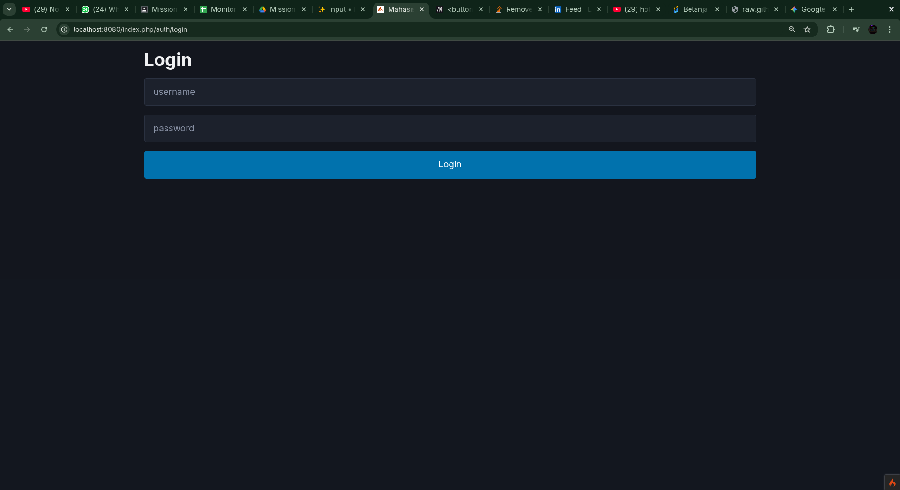

# Readme

## Cara menjalankan aplikasi

lakukan migrasi
```sh
php spark migrate
```

lakukan seed

```sh
php spark db:seed
```

Jalankan aplikasi

```sh
php spark serve
```

Login dengan akun admin

username: admin
password: admin


## ✨ Fitur

* **Manajemen Mahasiswa**: Admin dapat menambah, melihat, mengubah, dan menghapus data mahasiswa.
* **Manajemen Mata Kuliah**: Admin dapat menambah, melihat, mengubah, dan menghapus data mata kuliah.
* **Pengambilan Mata Kuliah**: Mahasiswa dapat mendaftar dan membatalkan pendaftaran pada mata kuliah yang tersedia.
* **Pencarian**: Memudahkan pencarian data mahasiswa dan mata kuliah.

---

## 💻 Teknologi yang Digunakan

* **PHP 8.1**
* **CodeIgniter 4**
* **MySQL**
* **PicoCSS**

---

## 📸 Screenshot

### Fitur General
- Login


- Logout


### Admin


*Tampilan Dashboard Admin*

Fitur yang dapat diakses oleh Admin:
- **Manajemen Mahasiswa**:
    - Melihat semua data mahasiswa.
      
    - Menambahkan data mahasiswa baru.
      
    - Mengubah data mahasiswa.
      
    - Menghapus data mahasiswa.
      
    - Melihat Detail Data Mahasiswa
      
      
- **Manajemen Mata Kuliah**:
    - Melihat semua data mata kuliah.
      
    - Menambahkan data mata kuliah baru.
      
    - Mengubah data mata kuliah.
      
    - Menghapus data mata kuliah.
      

### Student


*Tampilan Dashboard Mahasiswa*

Fitur yang dapat diakses oleh Mahasiswa:
- **Manajemen Mata Kuliah**:
    - Melihat daftar mata kuliah yang tersedia.
      
    - Mengambil mata kuliah (enroll).
      